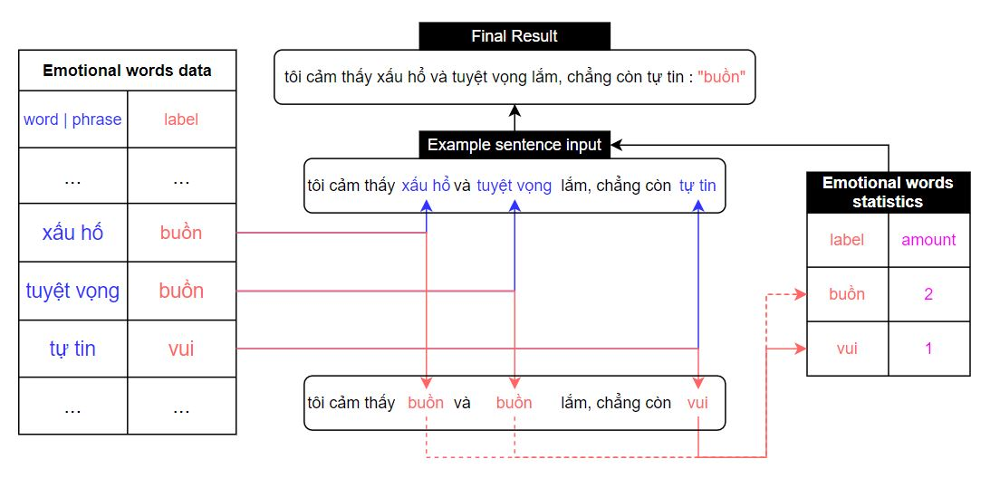

# Introduction
Sentiment detection is always an issue in any chatbot system because no one wants their bot to indifferently answer customer's questions. Furthermore, an effective rating system is a system that can knows how customers feel about an item according to their comments. Nowadays, although we have many algorithms that can do that, it still difficult for a newbie like you or me to clearly understand. So, in this project, you will build a sentiment analysis system in Vietnamese (Happy, sad, angry, normal) in easiest way. Let's go!

# Data words
Firstly, you need a emotional words data. In this example, I built it with the support of the students of Nguyen Khuyen School. If it has a problem, please still be happy and create the issue to fix it or contribute more word.

|Word or phrase|Label|
|-----|-----|
|vui vẻ|vui|
|tức giận|bực|
|lo lắng|buồn|
|bực mình|bực|
|rất sốc|buồn|
|hơi lo lắng|bình thường|
|kiêu ngạo|vui|
|xấu hổ|buồn|
|rất bối rối|buồn|
|chán|buồn|
|tự tin|vui|
|bị lừa|buồn|
|lúng túng|buồn|
|rất buồn|buồn|
|rất hạnh phúc|vui|
|thất vọng|buồn|
|vô cùng hạnh phúc|vui|
|nhiệt tình|vui|
|hứng thú|vui|
|xúc động|buồn|
|thèm muốn|vui|
|đố kỵ|bực|
|hơi xấu hổ|bình thường|
|tuyệt vọng|buồn|
|điên tiết|bực|
|...See more at data.json...|...See more at data.json...|

# How it work?
Everything in here just is basic statistics! According to the diagram below:



- Firstly, we will check words that already exist in the Emotional words data, get their label. Then, count each label. Finally, the emotional label of the sentence is the type that has more quantity than the others.

- How to calculate confidence?
- > conf = (amount of the label that has more quantity than the others / amount of all) * 100

# Example:
``` Yêu anh lắm đấy nhé , bao nhiêu tình yêu em đều trao cho anh . Nhưng sao anh lại ghét , em hận những ai bạc tình như vậy , đã thế em cũng ghét cũng hờn anh luôn ```

### Results
``` [bực, bực, bực, vui, vui] ```
- ==> label: bực : conf = (3/5)*100 = 60%

# Check accuracy of module
- With 57 sentence for test ( data_test.js ), the accuracy is 0.93.

# P/S: please using NodeJs to run this project. Type: node testsentiment.js for testing main emotion of a sad poem that had written by Vietnamese.

```
Khăn thương nhớ ai,
Khăn rơi xuống đất.
Khăn thương nhớ ai,
Khăn vắt lên vai.
Khăn thương nhớ ai,
Khăn chùi nước mắt.
Đèn thương nhớ ai,
Mà đèn không tắt.
Mắt thương nhớ ai,
Mắt ngủ không yên.
Đêm qua em những lo phiền,
Lo vì một nỗi không yên một bề…
```